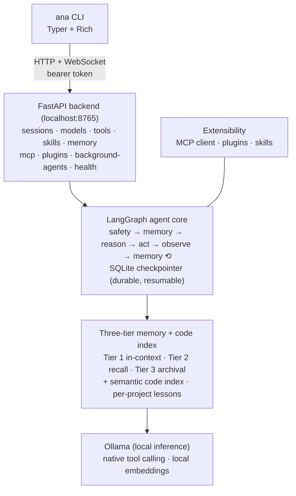

# Architecture

Ana is CLI-first: a Typer client talking to a local FastAPI backend that
runs a LangGraph agent over Ollama. Everything runs on your machine.

## Layered stack



## Agent graph topology

Each user turn runs through a fixed node sequence, looping between reason
and act until the model produces a final answer:

```
START
  → safety          Constitution check — blocks/warns on 8 principles; ends
  │                 the turn on a blocking violation
  → pre_memory      Retrieves Tier 2 + Tier 3 context, emits a
  │                 context-budget event
  → reason          LLM call, streams tokens; native tool call or parsed
  │                 code block; classifies output as final answer vs.
  │                 pending action
  → [no action?]    → END (final answer, parse failure after retries, or
  │                 iteration limit reached)
  → code_act        Checks the permission-mode allowlist + permission
  │                 rules; pauses for confirmation on destructive tools
  │                 unless auto_accept; runs post-edit verification
  → observe         Secrets redaction; wraps the result in a
  │                 content-isolation envelope
  → post_memory     Updates the budget, triggers compaction at ≥ 90%
  → reason          Next iteration if an action remains, else END
```

There is no separate LLM critic/reflection node — quality control is the
deterministic [verification](../features/verification.md) check run inside
the act step after a file mutation, not an extra model call.

## Key design decisions

**Native tool-calling over prompt emulation.** Models whose profile has
`supports_native_tools: true` bind tools directly through the backend;
there is no system-prompt tool-emulation layer to maintain.

**Durable, resumable sessions.** Every graph step checkpoints to SQLite,
so a session survives backend restarts and `/rewind` can fork the thread
back to any earlier point — see
[Sessions & rewind](../usage/sessions.md).

**Single compaction path.** Context compaction is reached only through the
memory node's background path (which also serves the user-initiated
`/compact`), with a begin/end guard preventing the double-compaction bug
where a summary of a summary progressively degrades context quality.

**Bearer-token localhost API.** The backend binds `127.0.0.1` and
generates a per-install token (`~/.ana/session.token`, `chmod 600`/ACL);
the CLI sends it on every HTTP and WebSocket request. See
[Security](security.md#bearer-token).

**Tier 2 warmup from git files.** On restart, the in-memory Tier 2 index
is rebuilt from Tier 3's git-backed JSON files (not from LanceDB) — even
if the vector DB is corrupted, the JSON files are plain text and always
readable.

**Permission modes, not agent personalities.** One agent, one system
prompt, and a 3-level permission model (`plan`/`default`/`auto_accept`)
controlling how much it may touch — see
[Permission modes](../configuration/permissions.md).

**Two independent sub-agent mechanisms.** The in-context `task` tool
(read-only, context-isolating) and the daemon-driven background agents are
deliberately separate systems — see
[Subagents & background agents](../features/subagents.md).

**Pluggable sandbox.** `run_python` always uses RestrictedPython; shell
tools go through a sandbox factory preferring Docker, then Bubblewrap
(Linux), falling back to local execution — see
[Security](security.md#sandbox).

## Where to go next

- [Permission modes](../configuration/permissions.md) — how tool access and
  confirmation work
- [Tools](../features/tools.md) — the full tool registry
- [Memory](../features/memory.md) — the three tiers, code index, lessons
- [Security](security.md) — constitution, sandboxing, secrets, path safety
- [Settings](../configuration/settings.md) — environment variables and
  config files
